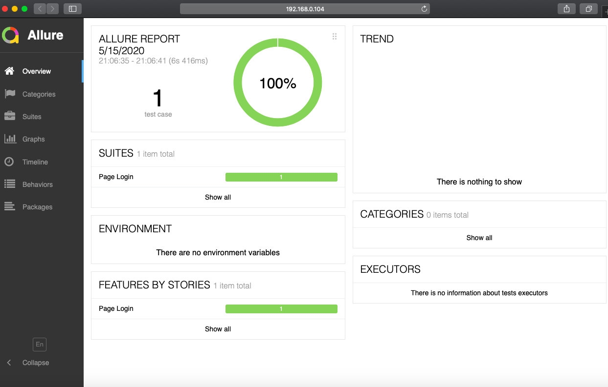

## Testcafe-Typescript-Starter

Testcafe typescript postman workspace automation with neat folder structure and allure report.

## Key highlights

- Typescript support
- Neat folder structure
- Page object model for code maintenance
- ESLint support for code quality
- Prettier for code formatting
- Allure reporting
- Husky for pre-commit hook
- No hard coded wait
- Special selectors are used for React. Elements are fetched with REACT's internal properties like `components`, `props` and `states`

```js
this.deleteOption = ReactSelector('OptionRenderer').withProps({
  label: 'Delete',
});
```

## Trailer


## System Dependencies

- Node
- JDK
- Browsers [chrome/firefox] should be pre-installed in your local system
- Docker (in-case interested in docker execution)

## Get started

#### Install dependencies

```ssh
npm install
```

#### Lint your code

```ssh
npm run lint
```

#### Run tests

Postman needs the `username` and `password` to login unto the workspaces. So, while execution the test commands, you need to set the `env variables` correctly

```ssh
USERNAME="test1@test.com" PASSWORD="test123" npm run test:chrome
```

Or run in `headless`

```ssh
USERNAME="test1@test.com" PASSWORD="test123" npm run test:headless
```

Reports will be generated inside `reports` folder.

#### Debug tests

If you are using vscode, debug configuration is provided `.vscode/launch.json` file. Enable your breakpoints and hit `f5` to trigger the debug execution.

## Test Folder Structure

```
testcafe
|____specs
| |____workspace.spec.ts
|____utils
| |____password.handler.ts
| |____selector.helper.ts
| |____index.ts
| |____logger.helper.ts
| |____database.helper.ts
| |____waiter.helper.ts
|____pages
| |____login.page.ts
| |____all-workspace.page
| |____index.ts
```

The page object model resides under `testcafe` folder.

- `pages` folder contains the page elements abd associated business logics
- `specs` folder contains testcafe fixures
- `utils` folder contains different testcafe helpers

## Docker execution commands

Custom docker container should be build to create a test environment with all required dependencies. The docker configuration is stored at `docker/Dockerfile`.

- Create the customized docker container

```ssh
npm run docker:build:testcafe
```

- Execute tests inside docker container

```ssh
npm run docker:test:chrome
```

- Stop the docker container after test

```ssh
npm run docker:stop:testcafe"
```

- Delete all docker container

```ssh
npm run docker:deleteAll
```

## Jenkins integration

jenkins test execution configuration is declared in `Jenkinsfile`

To know more about Testcafe jenkins integration, reach out to [My Blog](https://medium.com/@abhinabaghosh.1994/dockerize-your-testcafe-tests-and-integrate-with-jenkins-6e37b3bc0405)

## Allure report

Reports will be generated for each test cases and allure will integrate those results and combine.



## Before you go

You can go-thorough my other `open source` assignments

- My Blog - [here](https://medium.com/@abhinabaghosh.1994)
- My open source works - [here](https://github.com/abhinaba-ghosh)
- My Linkedin Profile - [here](https://www.linkedin.com/in/abhinaba-ghosh-9a2ab8a0/)
